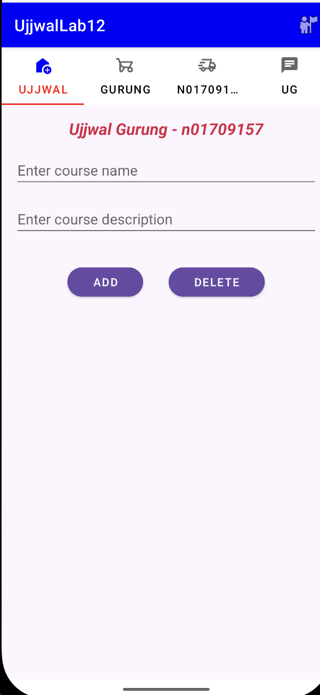
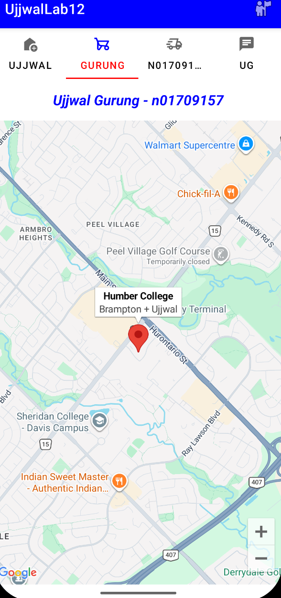
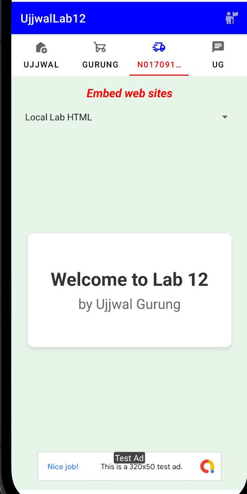
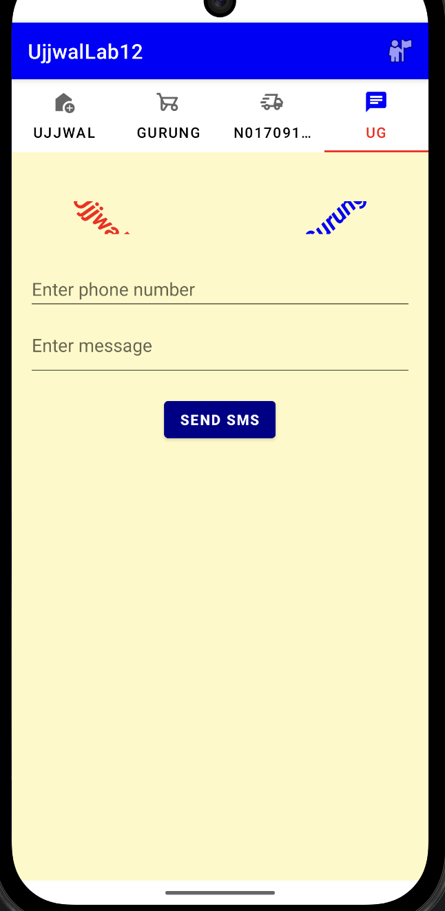

Ujjwal Gurung - n01709157
This Android application demonstrates a multi-fragment architecture utilizing a TabLayout to integrate Firebase Realtime Database operations, Google Maps API with location tracking and notifications, embedded web content with AdMob banners, and programmatic SMS messaging with runtime permissions.
Github Repo-https://github.com/ujjwalg005/UjjwalLab12

## App Screenshots

### 1. Firebase Database (Ujjwal Tab)

### 2. Google Maps (Gurung Tab)

### 3. Web View & AdMob (N01709157 Tab)

### 4. SMS Messaging (UG Tab)

